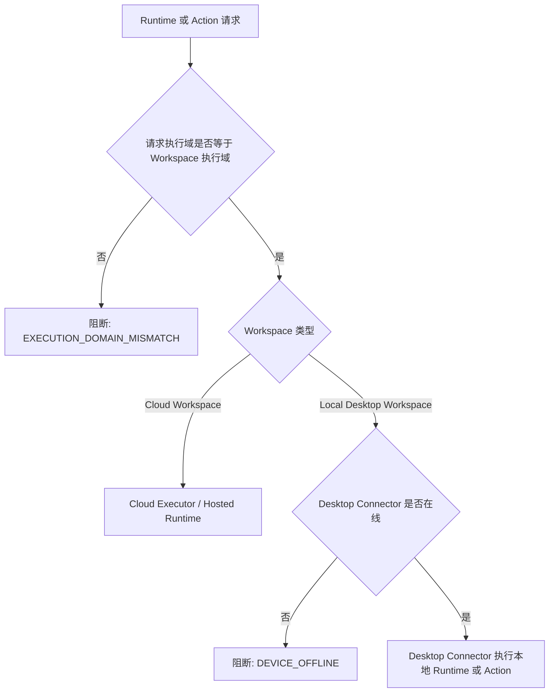
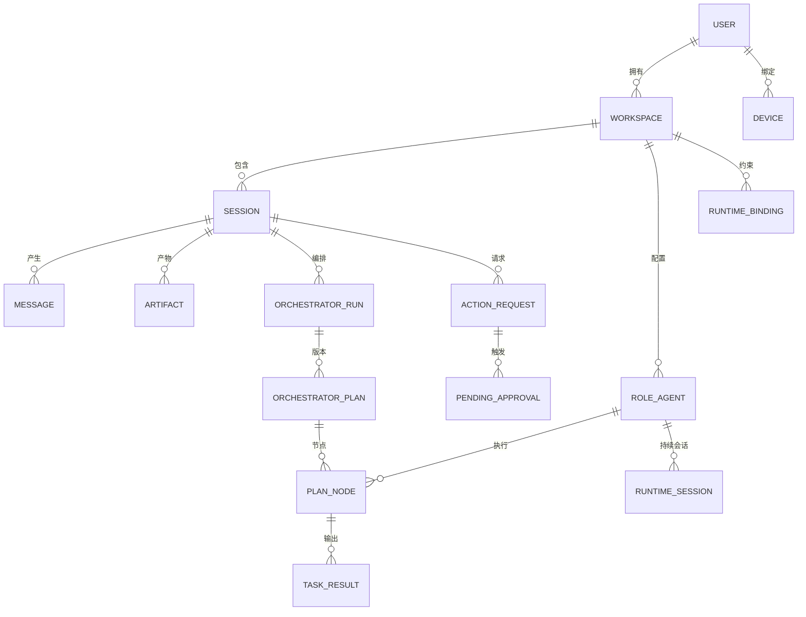
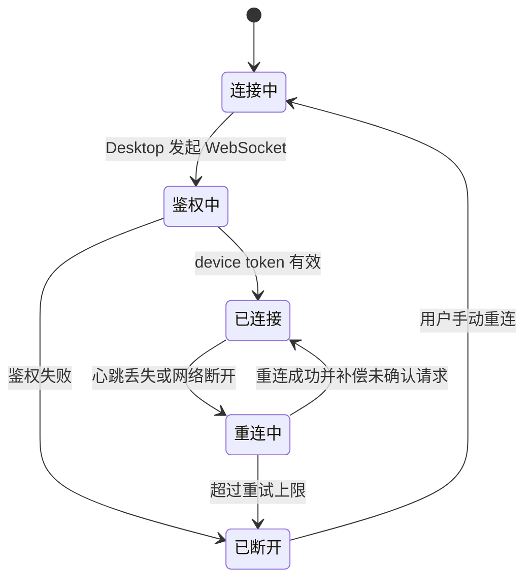
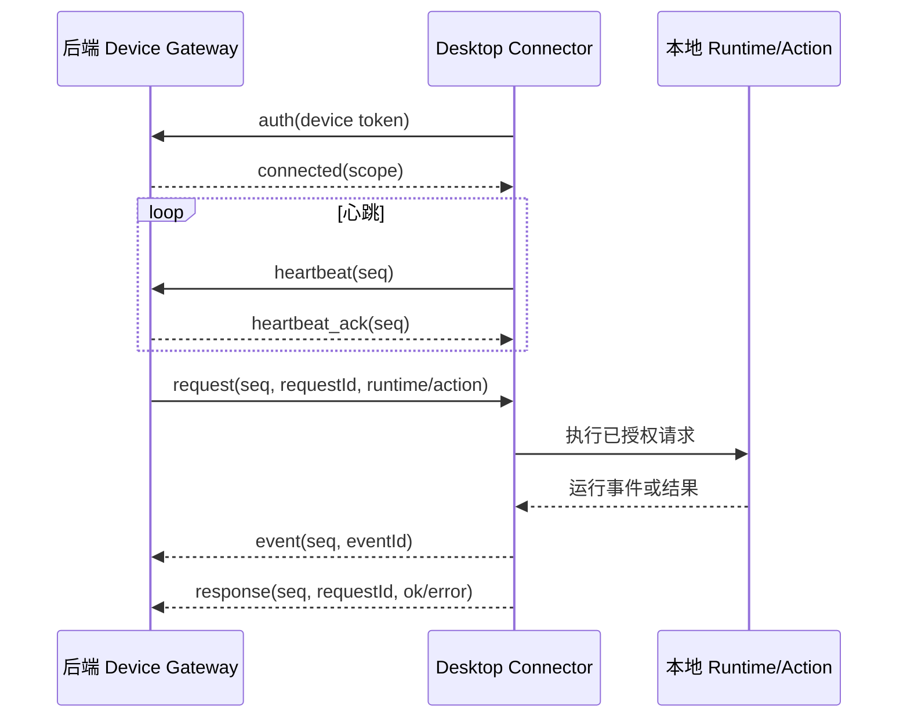
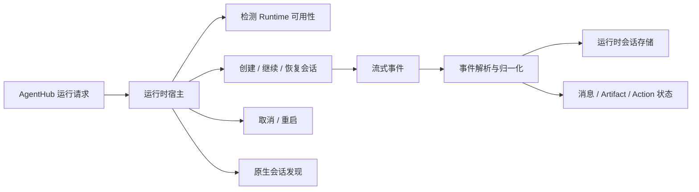
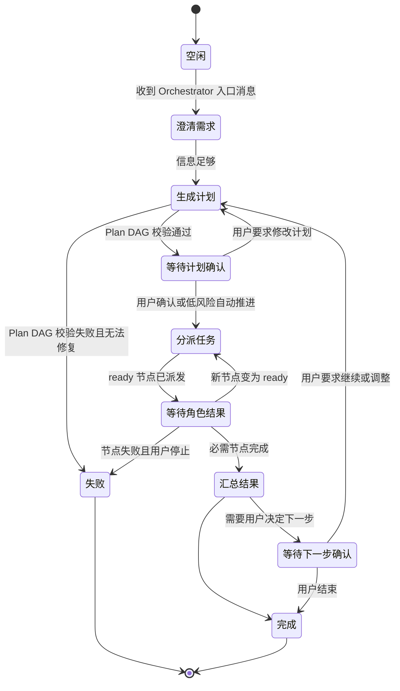
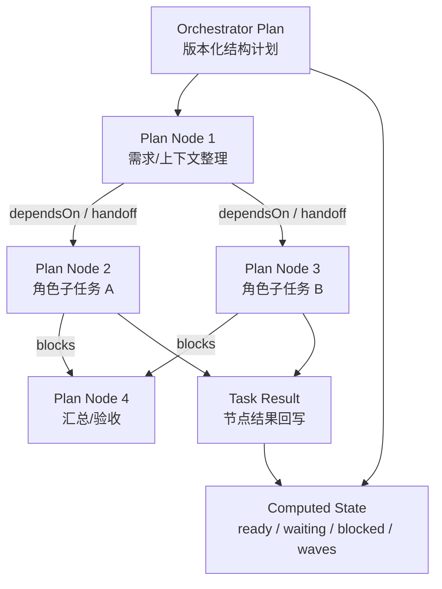
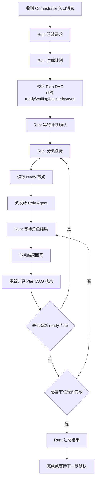
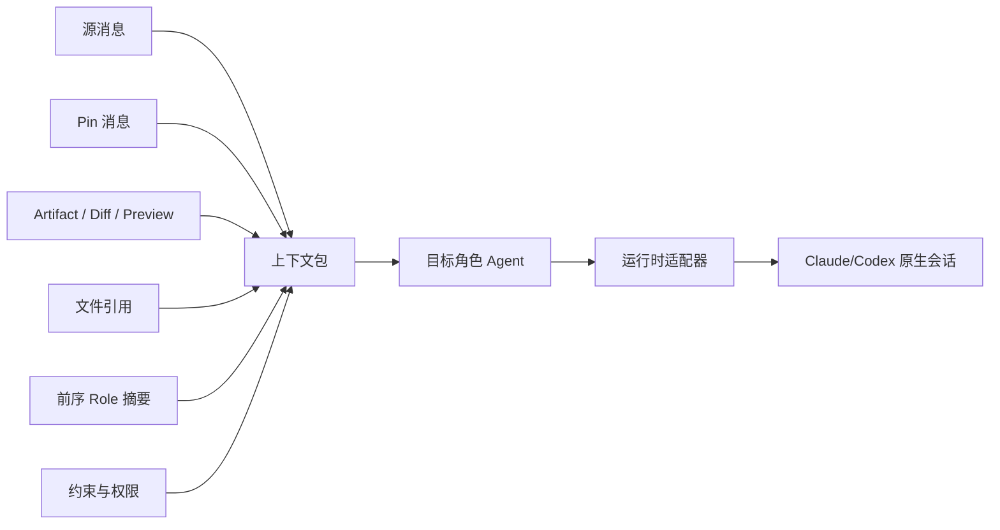

# AgentHub 技术设计文档

**作者：** joytion, Codex  
**日期：** 2026-05-25
**状态：** Draft  
**版本：** 0.1  
**上游文档：** `research/prd.md`, `research/product-design.md`  
**模块研究依据：** `research/modules/*.md`, `research/reference-repos/*.md`

---

## 1. 技术设计目标

本文把 PRD 和产品设计收敛为可实现的 P0 技术方案。模块研究文档是选型依据层；本文是后续实现、任务拆分和评审的主技术依据。

P0 技术目标：

1. 跑通 Web、Desktop、Mobile 三端配合完成的 AgentHub 开发流程。
2. 用统一数据模型约束 Cloud Workspace 和 Local Desktop Workspace，确保执行域不可混用。
3. 用统一 Runtime/Adapter 模型接入平台托管 Runtime、本地 Claude Code、本地 Codex。
4. 保证 Claude Code/Codex 接入是 native session continuity，而不是普通 API 文本调用。
5. 以 IM、消息、Artifact、Action、Approval、Runtime Event 的持久化数据作为真相源，Realtime 只作为投递层。

对应需求：`FR-AUTH-001`, `FR-WS-001`, `FR-DEVICE-001`, `FR-UI-001`, `FR-WEB-001`, `FR-DESK-001`, `FR-MOB-001`, `FR-CHAT-001`, `FR-RUNTIME-001`, `FR-ORCH-001`,
`FR-CTX-001`, `FR-ARTIFACT-001`, `FR-RESULT-001`, `FR-ACTION-001`, `FR-PERM-001`, `FR-NOTIFY-001`, `NFR-SEC-001`, `NFR-OBS-001`。

---

## 2. 最终技术路线

| 模块 | P0 技术路线 | 绑定需求 |
| --- | --- | --- |
| Web 主工作台 | Next.js App Router + React + TypeScript | `FR-WEB-001`, `FR-CHAT-001`, `FR-ARTIFACT-001` |
| UI 设计系统 | shadcn/ui 组件模式 + Tailwind CSS 4 + lucide-react；codeg/shadcn 为三端统一视觉母版，设计契约见 `research/ui-design-system.md` | `FR-UI-001`, `FR-WEB-001`, `FR-DESK-001`, `FR-MOB-001` |
| Desktop Connector | Electron + React + TypeScript；Electron main 负责本地能力 | `FR-DESK-001`, `FR-RUNTIME-001`, `FR-ACTION-001` |
| Mobile P0 | 同一 Next.js 应用的响应式 Web/PWA 路由 | `FR-MOB-001`, `FR-DEVICE-001` |
| Mobile Android 预留 | Capacitor 包装移动 Web/PWA；P0 不强制 Android Studio | `FR-MOB-001`, `FR-NOTIFY-101` |
| 共享层 | `packages/shared` 纯 TypeScript 类型、协议、状态机、API client | `FR-WS-001`, `FR-RUNTIME-001`, `FR-PERM-001` |
| Auth | Auth.js v5 + GitHub OAuth Provider（本地开发不依赖外部 Auth 服务） | `FR-AUTH-001` |
| DB | Postgres | `FR-WS-001`, `FR-CHAT-001`, `FR-RESULT-001` |
| Realtime | database-backed realtime 订阅消息、事件、审批状态 | `FR-CHAT-001`, `FR-NOTIFY-001` |
| Desktop 通道 | `DeviceChannel` 接口，P0 实现为 Desktop 主动 WebSocket 长连接 | `FR-DEVICE-001`, `FR-DESK-001`, `NFR-SEC-001` |
| Runtime Adapter | Hosted Runtime、Claude Code CLI Adapter、Codex CLI Adapter | `FR-RUNTIME-001`, `FR-AGENT-001`, `FR-CTX-001` |
| Action/CLI Adapter | 统一 `ActionRequest`，P0 支持 preview/test/build/shell，deploy 仅保留兼容字段 | `FR-ACTION-001`, `FR-PERM-001`, `FR-RESULT-001` |
| Orchestrator | 后端状态机托管 + Plan DAG；LLM 只生成澄清、候选计划、总结内容，系统负责 DAG 校验和 ready 节点调度 | `FR-ORCH-001`, `FR-CTX-001`, `FR-PERM-001`, `FR-RESULT-001` |

不进入 P0 的技术承诺：

- React Native/Expo 独立移动端。
- Tauri Desktop 替换 Electron。
- OpenCode Adapter。
- 完整部署平台。
- 非 Git checkpoint、patch stack、回滚系统。
- 多真人协作权限模型。

对应需求：`FR-RUNTIME-201`, `FR-PUBLISH-201`, `FR-VERSION-201`, `FR-COLLAB-201`。

---

## 3. 仓库与应用结构

推荐 Monorepo 结构：

```text
apps/
  web/
    app/                    # Next.js Web + Mobile PWA routes
    components/             # React DOM UI components
    server/                 # BFF/API route handlers, server actions, external BaaS clients
  desktop/
    src/main/               # Electron main: DeviceChannel, RuntimeHost, LocalExecutor
    src/preload/            # typed bridge, no broad Node exposure
    src/renderer/           # Connector Console React UI

packages/
  shared/
    src/domain/             # Workspace, Session, Message, Artifact, RoleAgent types
    src/protocol/           # DeviceChannel frames, RuntimeEvent, ActionRequest
    src/state-machines/     # message/action/orchestrator/permission states
    src/api-client/         # typed API client for web, desktop, mobile routes
    src/policies/           # execution-domain and permission policy functions

future/
  apps/mobile-native/       # React Native/Expo only if mobile workload becomes native-heavy
```

工程边界：

- Web UI 组件不承诺迁移到 React Native。
- `packages/shared` 不依赖 DOM、Electron、Node-only API 或 external BaaS SDK 实例。
- Electron renderer 不直接访问文件系统、shell、环境变量或子进程；只能通过 preload 暴露的 typed IPC 调 main process。
- Desktop main 是 Local Desktop Workspace 的本地执行边界。

对应需求：`FR-DEVICE-001`, `FR-WEB-001`, `FR-DESK-001`, `FR-MOB-001`, `FR-RUNTIME-001`, `NFR-SEC-001`。

---

## 4. 总体架构

```mermaid
flowchart LR
  User[用户]
  Web[Web 工作台 / Mobile PWA\nIM + Artifact + Approval]
  DesktopUI[Desktop Connector Console\n本地连接与状态]
  external BaaS[external BaaS\n身份 + 数据库 + 实时订阅]
  Backend[Next.js 后端/BFF\nOrchestrator + Policy]
  DeviceGateway[设备网关\nWebSocket]
  DesktopMain[Electron Main\n设备通道 + 运行时宿主 + 本地执行器]
  Hosted[云端托管 Runtime]
  Claude[本地 Claude Code CLI]
  Codex[本地 Codex CLI]
  CloudFS[云端项目目录]
  LocalFS[授权本地目录]

  User --> Web
  User --> DesktopUI
  Web --> Backend
  Web --> external BaaS
  DesktopUI --> DesktopMain
  DesktopMain --> DeviceGateway
  DeviceGateway --> Backend
  Backend --> external BaaS
  Backend --> Hosted
  Hosted --> CloudFS
  DesktopMain --> Claude
  DesktopMain --> Codex
  DesktopMain --> LocalFS
```

关键原则：

- Web 是完整工作台，Mobile PWA 是同一 Web 应用的轻量入口。
- Desktop 是 Connector，不复制三栏工作台。
- Cloud Workspace 的 Action 和 Runtime 只在云端项目目录执行。
- Local Desktop Workspace 的 Action 和 Runtime 只通过在线 Desktop Connector 执行。
- Web/Mobile 是控制端，可以对 Cloud Workspace 或 Local Desktop Workspace 发送消息、审批和 Action 指令；但本地文件读写、命令执行和 Runtime 调用只能由 Desktop Connector 落地。
- Web/Mobile 进程不承载本地文件执行能力，也不通过浏览器、手机或用户电脑端口绕过 Desktop Connector。

对应需求：`FR-DEVICE-001`, `FR-WS-001`, `FR-DESK-001`, `FR-MOB-001`, `FR-ACTION-001`, `NFR-SEC-001`。

---

## 5. 执行域模型

### 5.1 核心分类

| 分类 | 取值 | 说明 |
| --- | --- | --- |
| 执行域 | Cloud Workspace | 平台云端项目目录 + Hosted Runtime |
| 执行域 | Local Desktop Workspace | Desktop Connector 授权的本地目录 + 本地 Claude Code/Codex |
| Runtime | Hosted Runtime | 平台托管角色 Runtime |
| Runtime | Claude Code | Desktop Connector 调用本机 Claude Code CLI |
| Runtime | Codex | Desktop Connector 调用本机 Codex CLI |
| Runtime | OpenCode | P1/P2 预留，不进入 P0 |

### 5.2 强约束

| 约束 | 技术实现 |
| --- | --- |
| Workspace 创建后执行域不可变 | `workspaces.execution_domain` 创建后禁止更新 |
| Session 继承 Workspace 执行域 | `sessions.execution_domain` 由 Workspace 派生或冗余快照，不允许用户单独选择 |
| Role Agent Runtime 必须匹配 Workspace | 创建/更新 `role_agent_runtime_bindings` 时执行 policy 校验 |
| Action 执行位置必须匹配 Workspace | `actions.execution_domain` 由 Workspace 赋值，Executor 只按该字段路由 |
| Runtime session 不能跨域复用 | `runtime_sessions` 唯一键包含 `execution_domain` |
| 本地路径只能在授权 root 内 | Desktop main 对所有 path 做 resolve + root containment check |

### 5.3 运行时路由



阻断规则：

- `cloud` Workspace 不能绑定 `claude_code` 或 `codex`。
- `local_desktop` Workspace 不能绑定 `hosted` Runtime。
- Local Desktop Workspace 在 Desktop Connector 离线时可以聊天和查看历史，但不能执行 Runtime 或 Action。

对应需求：`FR-WS-001`, `FR-RUNTIME-001`, `FR-ACTION-001`, `FR-DESK-001`, `NFR-SEC-001`。

---

## 6. 身份、设备与 Workspace

### 6.1 Auth

P0 使用 Auth.js v5 + GitHub OAuth Provider。Web、Desktop、Mobile 共享同一 AgentHub user identity。

身份对象：

- `auth.users`: external BaaS 用户。
- `profiles`: AgentHub 用户资料，包含 GitHub identity 摘要。
- `devices`: Desktop Connector 设备记录。

Desktop 绑定建议：

1. 用户在 Web 登录后生成一次性 device binding code。
2. Desktop 输入绑定码或打开绑定链接。
3. 后端校验绑定码，把 Desktop 设备绑定到同一 user。
4. Desktop 获得 device token，用于 WebSocket DeviceChannel 鉴权。

对应需求：`FR-AUTH-001`, `FR-DESK-001`。

### 6.2 Workspace 创建

Cloud Workspace：

- Web 创建 Workspace。
- 后端创建云端项目目录记录。
- Role Agent 只能绑定 Hosted Runtime。

Local Desktop Workspace：

- Web 可发起创建，但本地文件夹选择必须由 Desktop 完成。
- Desktop 选择已有目录或按用户文件夹名创建目录。
- 后端保存 workspace root 的设备侧标识、展示名和 hash，不把 Web 变成任意本地路径写入入口。

对应需求：`FR-WS-001`, `FR-DEVICE-001`, `FR-DESK-001`。

---

## 7. 核心数据模型

本节只定义逻辑实体和关系，不直接约束数据库字段命名。实现时可在 external BaaS/Postgres 中拆表，并在 `packages/shared` 中维护对应类型。

### 7.1 核心实体关系



对应需求：`FR-AUTH-001`, `FR-WS-001`, `FR-CHAT-001`, `FR-AGENT-001`, `FR-RUNTIME-001`, `FR-ORCH-001`, `FR-ACTION-001`, `FR-RESULT-001`。

### 7.2 实体说明

| 实体 | 关键字段/状态 | 说明 | 绑定需求 |
| --- | --- | --- | --- |
| Workspace | 执行域、云端目录引用、Desktop 设备引用、本地 root 引用、默认权限策略 | 项目级边界，创建后执行域不可变 | `FR-WS-001` |
| Device | 设备类型、在线状态、最后心跳时间 | P0 只承载 Desktop Connector | `FR-DEVICE-001`, `FR-DESK-001` |
| Session | 所属 Workspace、路由模式、自动推进开关、会话状态 | IM 会话和 Orchestrator 执行的共同容器 | `FR-CHAT-001`, `FR-ORCH-001` |
| Message | 消息类型、流式状态、正文、关联 Artifact | 用户、Role Agent、系统状态都进入消息流 | `FR-CHAT-001` |
| Artifact | Markdown、代码块、图片、文件引用、网页预览、Diff、Action 状态 | Diff 是展示材料，不是审批对象 | `FR-ARTIFACT-001`, `FR-RESULT-001` |
| Role Agent | 名称、角色类型、System Prompt、能力标签、是否允许 Orchestrator 分派 | 用户面对的是角色，不是 Runtime 名称 | `FR-AGENT-001` |
| Runtime Binding | Runtime 类型、执行域、配置引用 | 绑定必须匹配 Workspace 执行域 | `FR-RUNTIME-001` |
| Runtime Session | native session ID、cwd、能力快照、调用状态 | 维持 Claude Code/Codex 原生上下文连续 | `FR-RUNTIME-001`, `FR-CTX-001` |
| Action Request | 类型、执行域、工作目录、风险等级、执行状态 | preview/test/build/shell/deploy 的统一请求 | `FR-ACTION-001` |
| Pending Approval | 来源、风险等级、审批状态、决策时间 | 审批绑定计划、Action、权限升级、重试 | `FR-PERM-001`, `FR-NOTIFY-001` |
| Task Result | 执行角色、状态、摘要、变更文件、关联 Diff/Preview/Action | 聊天流中的任务结果卡片数据源 | `FR-RESULT-001` |

### 7.3 编排计划相关实体

本节只说明 Orchestrator 编排会用到哪些实体，不单独画调度流程。

完整编排行为统一放在第 11 章；Plan DAG 的详细论证和校验规则集中在 `research/modules/orchestrator-plan-dag.md`。

| 计划对象 | 中文含义 | P0 必须记录 |
| --- | --- | --- |
| Orchestrator Run | 一次 Orchestrator 编排运行 | 所属 Workspace/Session、当前状态、当前计划版本、自动推进快照 |
| Orchestrator Plan | 某一版结构化计划 | 版本号、状态、摘要、节点列表、依赖边、计算状态 |
| Plan Node | 一个角色子任务 | 角色 Agent、目标、依赖、预期产物、上下文包、风险等级、节点状态、结果引用 |
| Plan Edge | 节点之间的关系 | 阻塞、handoff、审查、潜在冲突、关系原因 |
| Computed State | 后端计算结果 | ready、running、waiting、blocked、completed、failed、cycles、waves |

对应需求：`FR-ORCH-001`, `FR-CTX-001`, `FR-AGENT-001`, `FR-RUNTIME-001`, `FR-PERM-001`, `FR-RESULT-001`。

---

## 8. Realtime 与持久化策略

P0 采用 Postgres 作为真相源，database-backed realtime 作为订阅层。

订阅范围：

- Web/Mobile 订阅当前 Workspace/Session 的 messages、artifacts、actions、pending approvals、orchestrator runs。
- Desktop 订阅与自身 device/workspace 相关的 approvals 和 execution summaries；真正的本地执行请求通过 DeviceChannel 下发。

持久化规则：

- 消息、Artifact、Action、Approval、Runtime Event 必须落库。
- 流式 token 或 runtime event 可先写入 `runtime_events`，再聚合更新 `messages.content`。
- 前端断线重连后必须重新查询 Session snapshot，而不是假设 Realtime 没漏事件。
- DeviceChannel 帧带 `seq` 和 `requestId`，后端可检测 ack 和超时。

对应需求：`FR-CHAT-001`, `FR-NOTIFY-001`, `FR-RESULT-001`, `NFR-OBS-001`。

---

## 9. DeviceChannel 协议

`DeviceChannel` 是代码接口，P0 底层直接使用 WebSocket。它隔离鉴权、心跳、重连、ack、请求路由和事件回传。

### 9.1 连接生命周期



连接流程：

1. Desktop 用 device token 主动连接云端 WebSocket endpoint。
2. 首帧发送 auth。
3. 后端返回 connected 和 device/workspace scope。
4. 双方 heartbeat。
5. 断线后 Desktop 指数退避重连。
6. 重连后 Desktop 拉取 missed requests 或后端重放未 ack 请求。

### 9.2 帧模型



| 帧类别 | 方向 | 作用 | 必带标识 |
| --- | --- | --- | --- |
| request | 后端到 Desktop | 下发 Runtime、Action、检测、绑定本地目录等请求 | `seq`, `requestId`, `type` |
| response | Desktop 到后端 | 回应某个 request 的成功或失败 | `seq`, `requestId`, `ok/error` |
| event | Desktop 到后端 | 流式回传 Runtime、Action、检测、Workspace 状态事件 | `seq`, `eventId`, `type` |
| heartbeat | 双向 | 保持连接、检测断线和触发重连补偿 | `seq`, `sentAt` |

安全边界：

- Web/Mobile 可以控制 Local Desktop Workspace，但不与 Desktop 做点对点直连；控制请求统一进入后端，再通过 Desktop 主动建立的 DeviceChannel 下发。
- Desktop 只接受后端签发、scope 匹配、workspace 匹配的请求。
- 本地执行请求必须已经通过权限策略或审批。

对应需求：`FR-DEVICE-001`, `FR-DESK-001`, `FR-ACTION-001`, `FR-PERM-001`, `NFR-SEC-001`。

---

## 10. Runtime Adapter 设计

### 10.1 Adapter 分层

| 层 | 职责 |
| --- | --- |
| Runtime Detector | 检测 CLI/服务是否存在、版本、认证状态、能力声明 |
| Process/Transport Layer | launch、stdin、stdout、stderr、cancel、restart、timeout、HTTP/SSE |
| Runtime Parser | 把 Claude/Codex 原始输出映射成 `RuntimeEvent` |
| Runtime Session Store | 记录 AgentHub session 与 native session identity 的绑定 |
| Runtime Host | 按 Workspace 执行域把请求路由到 Hosted Runtime 或 Desktop main |

对应需求：`FR-RUNTIME-001`, `FR-DESK-001`, `FR-CTX-001`, `FR-PERM-001`。

### 10.2 Adapter 能力面



| 能力 | P0 作用 | Claude Code / Codex 要点 |
| --- | --- | --- |
| 检测 | 判断 CLI 是否安装、版本和登录状态 | Desktop main 执行，不在 Web/Mobile 执行 |
| 能力声明 | 记录是否支持 resume、continue、审批、流式事件、MCP/config | 影响 UI 展示和降级策略 |
| 创建会话 | 首次把 Role Agent 请求交给 Runtime | 绑定 Workspace root 和 Role Agent |
| 恢复/继续会话 | 保持 native session continuity | 优先使用 CLI 官方 resume/continue 能力 |
| 事件流 | 将文本、工具调用、审批、Artifact、完成/失败统一回传 | 原始输出只作诊断摘要，不直接暴露敏感内容 |
| 取消/重启 | 支持用户停止或失败重试 | 先优雅中断，必要时升级 kill |
| 原生会话发现 | 辅助校准 native session ID | 只读发现，不编辑 `~/.claude` 或 `~/.codex` 文件 |

### 10.3 Runtime 事件分类

| 事件类别 | 说明 | 消费方 |
| --- | --- | --- |
| started | Runtime invocation 已启动，可记录 invocation 和 native session | Backend、消息流 |
| session_discovered | 从 stdout/jsonl/filesystem 发现 native session ID | Runtime Session Store |
| text_delta | Agent 回复文本或思考片段 | Message 聚合 |
| tool_started / tool_delta / tool_completed | 工具或命令执行过程 | Action 状态卡、诊断面板 |
| approval_requested | Runtime 或权限策略要求用户确认 | Pending Approval |
| permission_mode_changed | Runtime 权限模式变化 | 审计与状态提示 |
| artifact_created | Runtime 产生文件、预览、Diff 等产物 | Artifact |
| completed | Runtime 正常结束 | Task Result |
| failed / cancelled | Runtime 失败或取消 | 错误码、重试、Orchestrator 失败分支 |

### 10.4 Claude Code 与 Codex 策略

Claude Code：

- P0 通过 Desktop main 启动 CLI 子进程。
- 使用 CLI 支持的 resume/continue 能力恢复原生会话，具体参数由实现阶段基于本机版本验证。
- 可以读取原生会话目录做 discovery，但 discovery 只是校准和回填，不直接编辑原生 JSONL。

Codex：

- P0 通过 Desktop main 启动 `codex exec --json` 或等价 JSONL 入口。
- 使用 Codex resume 能力恢复 native session。
- Codex approval、tool call、exit/error 归一化到 `RuntimeEvent`。

关键规则：

- Runtime Adapter 接收结构化 `ContextPackage` 和 `RuntimeInvokeInput`，不接收裸 prompt。
- `nativeSessionId` 必须进入 `runtime_sessions`。
- 同一 AgentHub Session 内同一 Role Agent 后续消息优先 resume 对应 native session。
- Parser 失败时保留 raw event 摘要并生成 diagnostic failure，不能静默丢事件。
- `dangerous_bypass` 或类似危险权限模式不得默认启用。

对应需求：`FR-RUNTIME-001`, `FR-AGENT-001`, `FR-CTX-001`, `FR-RESULT-001`, `FR-PERM-001`。

---

## 11. Orchestrator 编排模型

Orchestrator 编排模型是一套机制的两个层次，不是两个独立功能：

- Run 状态机负责「一次 Orchestrator 编排运行处于哪个阶段」。
- Plan DAG 负责「该运行中的计划节点如何依赖、并行、阻塞和汇总」。
- 状态机是外层生命周期，Plan DAG 是 `planning` 阶段产出的内层计划结构。

Orchestrator 是 PM 型 Role Agent，但状态推进由后端控制。LLM 负责生成澄清问题、候选计划和总结；系统负责计划校验、权限判断、ready 节点调度和失败分支。

### 11.1 Run 状态机



Run 状态机的核心阶段：

| 阶段 | 说明 | 进入条件 |
| --- | --- | --- |
| 空闲 | 没有运行中的编排 | Session 未触发 Orchestrator |
| 澄清需求 | Orchestrator 补齐目标、约束、验收口径 | 用户输入不足以直接规划 |
| 生成计划 | 生成候选 Plan DAG 并做后端校验 | 信息足够，或用户要求修改计划 |
| 等待计划确认 | 展示计划卡，等待用户确认或自动推进策略 | Plan DAG 校验通过 |
| 分派任务 | 调度 ready 节点给对应 Role Agent | 计划已确认，且权限满足 |
| 等待角色结果 | 等待节点执行结果并重新计算 DAG 状态 | 已有节点派发 |
| 汇总结果 | 汇总节点结果，生成结论和下一步 | 必需节点完成 |
| 等待下一步确认 | 需要用户决定继续、重试、停止或执行高风险动作 | 结果需要后续决策 |
| 完成/失败 | Run 结束 | 全部完成、用户停止或不可恢复失败 |

### 11.2 Plan DAG

Plan DAG 是 Run 内部的结构化计划真相源。计划卡、审批、Role Agent 分派、失败展示都从 Plan DAG 渲染或计算，不从一段 Markdown 计划反推。



| 规则 | 处理 |
| --- | --- |
| DAG 有环 | 计划不能确认，要求 Orchestrator 重新规划 |
| 节点 Role Agent 不属于当前 Workspace | 计划不能执行 |
| Role Agent Runtime 与 Workspace 执行域不一致 | 计划不能执行 |
| 依赖节点不存在或仍在执行 | 下游节点进入 blocked/waiting，不得派发 |
| 节点风险等级超过自动推进策略 | 生成 Pending Approval |
| 同一 wave 存在明显文件冲突 | P0 默认串行化或要求用户确认 |

P0 scheduler 使用拓扑层思想：只有 `dependsOn` 全部 completed/skipped 且权限已满足的节点可以进入 `ready`。

同一 `wave` 的 ready 节点可并行派发；P1/P2 再扩展 quorum、优先级、取消传播和更复杂的失败恢复。

### 11.3 状态机如何驱动 DAG



1. 后端创建 `orchestrator_run`。
2. 需求不足时进入 `clarifying` 并生成澄清问题。
3. 信息足够时进入 `planning`，LLM 生成候选 Plan DAG。
4. 后端运行 Plan DAG validator，计算 `ready`、`waiting`、`blocked`、`cycles`、`waves`。
5. 默认进入 `requires_plan_confirmation`，计划卡从结构化 Plan DAG 渲染。
6. 用户确认后进入 `dispatching`。
7. 后端为 ready 节点构造 `ContextPackage`，按 wave 分派给 Role Agent。
8. Runtime/Action 事件持续写入 `runtime_events`、`messages`、`actions`，节点状态写回 `orchestrator_plans`。
9. 节点完成后重新计算 ready/waiting/blocked；所有必需节点完成后进入 `summarizing`。
10. Orchestrator 汇总结果，进入 `completed` 或 `requires_next_step_confirmation`。

### 11.4 路由规则

| 输入 | 路由 |
| --- | --- |
| 未 @ Role Agent | Orchestrated Flow |
| @ Orchestrator | Orchestrated Flow |
| @ 单个非 Orchestrator Role Agent | Direct Role Flow |
| @ 多个 Role Agent | Orchestrated Flow |
| Direct Role 判断需多角色 | 请求用户升级到 Orchestrated Flow |

### 11.5 自动推进

- 用户必须显式开启 Session `autoProceedEnabled`。
- 自动推进只跳过低风险计划确认和普通下一步确认。
- 高风险 Action、权限升级、部署/发布、删除/覆盖/批量修改必须确认。

对应需求：`FR-CHAT-001`, `FR-ORCH-001`, `FR-CTX-001`, `FR-PERM-001`, `FR-NOTIFY-001`。

---

## 12. Context Package 与 Handoff



| 内容 | 说明 |
| --- | --- |
| Workspace / Session | 明确上下文所属边界，避免跨 Workspace 误用 |
| 源消息 | 用户触发任务的消息和必要引用 |
| Pin 消息 | 用户手动固定的长期上下文 |
| Artifact | 代码块、文件引用、Diff、预览、结果卡片 |
| 文件引用 | 路径和引用原因，必须受 root containment 约束 |
| 前序 Role 摘要 | 上游节点或其他 Role Agent 的结论 |
| 当前目标 | 本次 handoff 的目标和验收口径 |
| 约束 | 权限、风险、执行域、不得触碰范围等 |

Handoff 规则：

- 目标永远是 Role Agent，不是 Claude Code、Codex 等 Runtime 名称。
- Context Package 可以被用户查看、引用、pin。
- Handoff 到绑定 Claude Code/Codex 的 Role Agent 时，Adapter 尝试恢复该 Role Agent 在当前 Session 的 native session。
- 文件引用必须受 Workspace execution domain 和本地 root/cloud root 约束。

对应需求：`FR-CTX-001`, `FR-RUNTIME-001`, `FR-AGENT-001`, `FR-ARTIFACT-001`。

---

## 13. Action/CLI 与权限模型

### 13.1 Action Executor

| Workspace 类型 | Executor | 路径约束 |
| --- | --- | --- |
| Cloud Workspace | Cloud Executor | `workingDirectory` 在云端项目目录内 |
| Local Desktop Workspace | Desktop Executor | `workingDirectory` 在授权 local root 内 |

P0 Action：

- `preview`: 启动 dev server 或返回 preview URL。
- `test`: 运行测试命令。
- `build`: 运行构建命令。
- `shell`: 受控 shell 命令。
- `deploy`: 仅保留兼容状态，不做真实部署平台。

### 13.2 权限矩阵

| 对象 | 默认风险 | P0 确认策略 |
| --- | --- | --- |
| Orchestrator 计划 | medium | 默认确认，可被 Session 自动推进跳过 |
| 低风险读取或状态查询 | low | 可按策略自动 |
| 启动预览 | medium | 默认确认 |
| 测试/构建 | medium | 可按 Session 策略确认或自动 |
| Shell 命令 | high | 必须确认 |
| 删除/覆盖/批量修改 | high | 必须确认 |
| 部署/发布 | high | 必须确认 |
| 失败重试 | medium | 默认确认 |

Diff 展示不是审批对象；需要确认的是 Action、计划、下一步、权限升级或失败重试。

对应需求：`FR-ACTION-001`, `FR-PERM-001`, `FR-NOTIFY-001`, `FR-RESULT-001`。

---

## 14. API 契约草案

P0 可以先由 Next.js Route Handlers 或 Server Actions 实现，后续再拆独立 API 服务。

| API | 方法 | 用途 | 绑定需求 |
| --- | --- | --- | --- |
| `/api/workspaces` | `GET/POST` | 列表、创建 Workspace | `FR-WS-001` |
| `/api/workspaces/:id` | `GET` | Workspace 详情和执行域状态 | `FR-WS-001`, `FR-DEVICE-001` |
| `/api/sessions` | `GET/POST` | Session 列表和创建 | `FR-CHAT-001` |
| `/api/sessions/:id/messages` | `GET/POST` | 消息读取和发送 | `FR-CHAT-001` |
| `/api/role-agents` | `GET/POST/PATCH` | Role Agent 模板、创建、编辑 | `FR-AGENT-001` |
| `/api/runtime-bindings` | `POST/PATCH` | 绑定 Runtime，执行域校验 | `FR-RUNTIME-001` |
| `/api/orchestrator-runs` | `POST` | 创建 Orchestrator run | `FR-ORCH-001` |
| `/api/orchestrator-runs/:id/plan` | `GET/PATCH` | 查看计划、要求修改计划、提交 plan version | `FR-ORCH-001`, `FR-CTX-001` |
| `/api/orchestrator-runs/:id/dispatch` | `POST` | 确认后派发 ready plan nodes | `FR-ORCH-001`, `FR-PERM-001` |
| `/api/actions` | `POST` | 创建 ActionRequest | `FR-ACTION-001` |
| `/api/approvals/:id/decision` | `POST` | 批准或拒绝确认项 | `FR-PERM-001`, `FR-NOTIFY-001` |
| `/api/devices/bind-code` | `POST` | 生成 Desktop 绑定码 | `FR-AUTH-001`, `FR-DESK-001` |
| `/api/devices/ws` | `WebSocket` | Desktop DeviceChannel | `FR-DESK-001`, `FR-DEVICE-001` |

API 层必须调用 shared policy：

- `assertWorkspaceAccess(userId, workspaceId)`
- `assertExecutionDomainMatch(workspace, request)`
- `assertRuntimeBindingAllowed(workspace, runtimeKind)`
- `assertActionAllowedOrCreateApproval(action, policy)`
- `assertPathInsideWorkspaceRoot(path, root)`，本地版本只在 Desktop main 执行

对应需求：`FR-AUTH-001`, `FR-WS-001`, `FR-RUNTIME-001`, `FR-ACTION-001`, `FR-PERM-001`。

---

## 15. 前端实现边界

### 15.1 Web

P0 页面：

- 登录页。
- Workspace 列表与创建向导。
- 三栏 IM 工作台。
- Role Agent 面板。
- Pending Approvals 队列。
- Workspace 设置页。

核心组件：

- `MessageRenderer`
- `MarkdownBlock`
- `CodeBlockWithCopy`
- `ArtifactCard`
- `DiffCard`
- `ActionStatusCard`
- `TaskResultCard`
- `OrchestratorPlanCard`
- `PermissionConfirmationCard`
- `RoleMentionPicker`

UI 约束：

- Web 必须以三栏 IM 工作台作为主体验，不能用营销式首页替代。
- 组件基线为 `shadcn/ui + Tailwind CSS 4 + lucide-react`，布局和组件状态引用 `research/ui-design-system.md`。
- AionUi 的聊天/预览分栏和 codeg 的侧栏、会话壳、输入框工具条是主要实现参考。
- 关键页面必须具备 `data-testid` 或稳定可访问定位点，供 Playwright 截图和布局断言使用。

对应需求：`FR-WEB-001`, `FR-CHAT-001`, `FR-ARTIFACT-001`, `FR-RESULT-001`, `FR-ORCH-001`, `FR-UI-001`。

### 15.2 Desktop

P0 页面：

- 登录/设备绑定。
- Desktop 主壳：左侧导航/Session、中间本地 Agent 轻量会话、右侧 Agent 配置中心与 Runtime 状态。
- Connector 首页状态：在线、设备、Workspace、最近心跳和云端可达性。
- 本地 Workspace 绑定。
- Runtime 检测。
- Agent 配置中心：Codex、Claude Code 已接入；OpenCode 和其他 Runtime 待接入。
- 本地 Agent 会话/运行态入口。
- 执行请求列表。
- 待审批队列。
- 打开 Web。

Desktop main 服务：

- `DeviceChannelService`
- `WorkspaceFolderService`
- `RuntimeDetectorService`
- `RuntimeHostService`
- `LocalExecutorService`
- `AuditEventService`

UI 约束：

- Desktop renderer 必须呈现完整桌面主壳，不复制完整 Web 三栏工作台，也不能退化为单页检测面板。
- Desktop 主壳必须包含左侧导航/Session、中间本地 Agent 轻量会话、右侧 Agent 配置中心与 Runtime 状态，布局可折叠但核心入口不能消失。
- Runtime 检测 UI 展示安装、版本、CLI path、原生认证状态、能力声明、最近诊断和进入轻量会话动作；本地 Claude Code / Codex 不渲染 API Key、Base URL 或环境变量保存表单。
- Agent 配置中心必须区分 P0 已接入和待接入 Runtime：Codex、Claude Code 已接入；OpenCode 和其他 Runtime 显示待接入且不可执行。
- Desktop 可借鉴 AionUi 的 Layout/Sider/Router、Local Agents 检测卡、AgentCard 和桌面 ChatLayout，也可借鉴 codeg 的 Sidebar、ConversationShell、MessageInput 和 PermissionDialog；cherry-studio 只用于桌面密度和设置分组，但凭证边界必须服从 `FR-RUNTIME-001` 与 `.trellis/spec/cross-layer/runtime-credential-boundary.md`。
- Desktop 轻量会话必须经后端和 DeviceChannel 路由到当前 Local Desktop Workspace，不允许 Electron renderer 直接拼 shell 命令或绕过权限策略。
- 打开 Web 工作台入口必须指向有效 Workspace/Session；Web 不可用、未登录或 Workspace 不存在时，Desktop 内展示中文错误和下一步，不允许打开空白页。
- Electron E2E 必须覆盖 Desktop 主壳、Agent 配置中心、Runtime 检测、本地 Agent 轻量会话、打开 Web 工作台状态、执行活动和待审批状态截图。

对应需求：`FR-DESK-001`, `FR-RUNTIME-001`, `FR-ACTION-001`, `FR-NOTIFY-001`, `FR-UI-001`。

### 15.3 Mobile PWA

P0 页面：

- 登录页。
- Workspace 列表。
- Session 列表。
- 轻量 Session 页。
- 审批详情页。
- 预览页。

降级规则：

- 不提供本地 Runtime 接入。
- 不选择本地文件夹。
- Diff 只读展开。
- 大输出默认折叠。

UI 约束：

- Mobile/PWA 使用同一 Next.js 应用的响应式路由，P0 不启动独立 React Native 交付线。
- 小屏采用单栏或分步导航；Workspace、Session、审批和预览是主入口。
- 参考 lobehub 的移动会话布局，但不引入完整模型供应商配置流程。
- Playwright Mobile 视口必须验证无横向滚动、底部/顶部导航不遮挡消息和审批动作。

对应需求：`FR-MOB-001`, `FR-NOTIFY-001`, `FR-ARTIFACT-001`, `FR-RESULT-001`, `FR-UI-001`。

---

## 16. 错误码与可观察性

标准错误族：

| 错误码 | 场景 |
| --- | --- |
| `AUTH_REQUIRED` | 用户、设备或 Runtime 未登录 |
| `DEVICE_OFFLINE` | Local Desktop Workspace 的 Desktop Connector 不在线 |
| `EXECUTION_DOMAIN_MISMATCH` | Runtime/Action 与 Workspace 执行域不一致 |
| `RUNTIME_NOT_FOUND` | Claude Code/Codex CLI 未检测到 |
| `RUNTIME_AUTH_REQUIRED` | Runtime 本身未登录或不可调用 |
| `NATIVE_SESSION_NOT_FOUND` | resume 的 native session 不存在 |
| `CWD_MISMATCH` | native session 或请求 cwd 与 Workspace root 不匹配 |
| `APPROVAL_REQUIRED` | 策略要求用户确认 |
| `APPROVAL_REJECTED` | 用户拒绝执行 |
| `PATH_OUTSIDE_WORKSPACE` | 本地或云端路径越界 |
| `ACTION_FAILED` | Action 执行失败 |
| `PARSER_UNSUPPORTED_EVENT` | Runtime 原始事件无法解析 |

可观察性原则：

- 用户可见：失败原因、是否可重试、需要去哪里修复。
- 系统可查：runtime raw event 摘要、action stdout/stderr 摘要、device seq/ack 状态。
- 不提交或展示：密钥、完整敏感环境变量、用户未授权路径内容。

对应需求：`FR-DESK-001`, `FR-RUNTIME-001`, `FR-ACTION-001`, `NFR-OBS-001`, `NFR-SEC-002`。

---

## 17. P0 实现顺序

### 17.1 基础骨架

1. 建立 monorepo：`apps/web`, `apps/desktop`, `packages/shared`。
2. 建立 shared domain types、FR-ID 常量、execution domain policy。
3. 接入 Auth.js v5 + GitHub OAuth。

绑定需求：`FR-AUTH-001`, `FR-WS-001`, `FR-DEVICE-001`。

### 17.2 Workspace 与 IM

1. Workspace 创建、列表、执行域展示。
2. Session 创建、消息发送、消息列表。
3. Markdown 渲染、代码高亮、复制、基础 Artifact 卡片。

绑定需求：`FR-WS-001`, `FR-WEB-001`, `FR-CHAT-001`, `FR-ARTIFACT-001`。

### 17.3 Desktop Connector

1. Desktop 设备绑定。
2. WebSocket DeviceChannel。
3. 本地 Workspace 文件夹绑定。
4. Claude Code/Codex 检测。

绑定需求：`FR-DESK-001`, `FR-RUNTIME-001`, `FR-DEVICE-001`。

### 17.4 Runtime Adapter

1. Hosted Runtime 最小实现，用于 Cloud Workspace 角色。
2. Claude Code CLI Adapter。
3. Codex CLI Adapter。
4. `runtime_sessions` native session identity 记录和 resume。
5. 本地 Claude Code / Codex 只检测原生 CLI 安装、版本、认证状态和能力声明；P0 不保存本地 CLI API Key，也不在 App 内代执行 CLI 登录流程。

绑定需求：`FR-RUNTIME-001`, `FR-AGENT-001`, `FR-CTX-001`。

### 17.5 Orchestrator、Action 与审批

1. Orchestrator 状态机、Plan DAG 数据模型和 validator。
2. 计划卡从 Plan DAG 渲染，支持确认、修改计划、停止。
3. Pending Approval 队列。
4. ActionRequest preview/test/build/shell。
5. Task Result Card、Diff Artifact、Preview URL。

绑定需求：`FR-ORCH-001`, `FR-ACTION-001`, `FR-PERM-001`, `FR-NOTIFY-001`, `FR-RESULT-001`。

### 17.6 Mobile PWA

1. 移动 Workspace/Session 列表。
2. 轻量消息、@ Role Agent。
3. 审批详情。
4. 预览页和结果摘要。

绑定需求：`FR-MOB-001`, `FR-CHAT-001`, `FR-NOTIFY-001`, `FR-RESULT-001`。

---

## 18. 测试策略

P0 必须优先覆盖会导致安全边界或核心开发流程失败的测试。

| 测试范围 | 必测点 | 绑定需求 |
| --- | --- | --- |
| Policy unit tests | execution domain mismatch、runtime binding allowed、action risk policy | `FR-WS-001`, `FR-RUNTIME-001`, `FR-PERM-001` |
| Shared state tests | message/action/orchestrator 状态转移、Plan DAG 无环校验、ready/waiting/blocked/waves 计算 | `FR-CHAT-001`, `FR-ACTION-001`, `FR-ORCH-001` |
| API integration tests | Workspace、Session、Message、Approval CRUD 与鉴权 | `FR-AUTH-001`, `FR-CHAT-001`, `FR-NOTIFY-001` |
| Desktop unit tests | path containment、request scope、runtime detection parse | `FR-DESK-001`, `NFR-SEC-001` |
| Runtime adapter tests | Claude/Codex parser fixture、resume fallback、error mapping | `FR-RUNTIME-001`, `FR-CTX-001` |
| 本地 Runtime 凭证边界测试 | 本地 Runtime 绑定拒绝 API Key/env/baseUrl，UI 不渲染本地 CLI API Key 输入框或 App 内登录按钮 | `FR-AGENT-001`, `FR-RUNTIME-001`, `NFR-SEC-002` |
| Web E2E | GitHub OAuth mock、创建 Workspace、三栏工作台、发送消息、审批 Action、展示结果卡、Artifact/Preview 展开 | `FR-WEB-001`, `FR-CHAT-001`, `FR-RESULT-001`, `FR-UI-001` |
| Mobile/PWA E2E | 390x844 视口下 Workspace、Session、轻量消息、审批详情、预览页 | `FR-MOB-001`, `FR-NOTIFY-001`, `FR-UI-001` |
| Electron Desktop E2E | Connector 首页、设备状态、Runtime 检测、执行活动、待审批、本地 Runtime 不出现 API Key 表单 | `FR-DESK-001`, `FR-RUNTIME-001`, `FR-UI-001` |
| 视觉与布局回归 | 关键页面截图、无横向滚动、卡片不重叠、文本不溢出、加载/错误/空状态稳定 | `FR-UI-001`, `NFR-UX-003` |

测试原则：

- Adapter parser 使用 fixture，不依赖每次测试真实调用 CLI。
- 真 CLI 验证作为手工或 gated integration test。
- 本地路径越界和 execution domain mismatch 必须是自动化测试。
- Web 与 Mobile/PWA 统一使用 Playwright browser projects；Electron 使用 Playwright Electron runner。P0 不使用单一黑盒工具覆盖所有端。
- Playwright 断言不能只停留在 `toBeVisible`，核心 UI 必须增加截图、bounding box、文本溢出和横向滚动断言。
- 视觉截图不得包含密钥、完整敏感环境变量或未授权本地路径；本地 Runtime 凭证边界测试必须在截图前后都生效。
- 视觉基线和组件约束以 `research/ui-design-system.md` 与 `.trellis/spec/frontend/ui-style-guidelines.md` 为准。

### 18.1 E2E 工具流分端策略

| 端 | 工具 | 适配理由 | CI 形态 |
| --- | --- | --- | --- |
| Web 桌面 | Playwright Chromium | 当前仓库已配置 Playwright，适合 Next.js 工作台、截图和布局断言 | `test:e2e` 增加 desktop project |
| Mobile/PWA | Playwright mobile viewport / device profile | P0 Mobile 是同一 Next.js PWA，Playwright 可直接模拟移动视口和触控交互 | `test:e2e` 增加 mobile project |
| Desktop Electron | Playwright Electron | 当前已有 `e2e/playwright.desktop.config.ts`，可真实启动 Electron renderer 并截图 | `test:e2e:desktop` |
| 未来原生移动壳 | Maestro 或 Appium 评估 | 只有进入 Capacitor/原生移动壳后才需要引入；P0 不提前承担复杂度 | P1/P2 决策 |

对应需求：`NFR-SEC-001`, `NFR-OBS-001`, `FR-RUNTIME-001`, `FR-ACTION-001`, `FR-UI-001`。

### 18.2 自动化执行与需求反写门禁

参考 `research/automation-reference-comparison.md`，AgentHub 的自动化实现采用两层策略：

| 层级 | 参考来源 | AgentHub 落点 |
| --- | --- | --- |
| 自动执行闭环 | Maestro-Flow | plan -> execute -> verify -> review -> test -> gap plan/fix loop |
| 需求和验收治理 | CodeStable | 需求不清暂停、PRD 反写、任务切片更新、验收后回写 |

执行阶段必须遵守以下门禁：

- 每个 `.trellis/tasks/*/` 任务必须绑定 `FR-ID`、`read_first`、`reference_sources`、测试锚点和收敛标准。
- 涉及 UI 的任务必须读取 `research/ui-design-system.md`、`research/modules/ui-and-visual-testing.md`、`.trellis/spec/frontend/ui-style-guidelines.md` 和对应参考项目来源。
- 任务无法映射到现有 `FR-ID` 时，暂停实现，更新 `research/prd.md` 或新增 `research/prd-amendments/*.md` 后再继续。
- 参考项目建议与 PRD、产品设计或 UI 契约冲突时，暂停实现并记录取舍，不能在代码里隐式改范围。
- E2E 或截图暴露视觉契约缺口时，先补测试和任务验收，再修 UI。
- verify/review/test 失败时生成 gap plan，再进入修复；不能无计划地连续修改同一区域。

P0 不把 mobile-dev-inc Maestro 当作三端 E2E 主工具。它只在后续进入 Capacitor 或原生移动壳后，与 Appium 一起重新评估。

对应需求：`FR-ORCH-001`, `FR-CTX-001`, `FR-RESULT-001`, `FR-UI-001`, `FR-PERM-001`, `NFR-OBS-001`。

---

## 19. 风险与缓解

| 风险 | 影响 | 缓解 |
| --- | --- | --- |
| Claude/Codex CLI 输出 schema 变化 | Parser 失效、事件丢失 | Adapter 带版本、保留 raw event 摘要、fixture 测试、降级 diagnostic event |
| native session discovery 不稳定 | 用户误以为上下文已连续 | resume 以 CLI 能力为主，discovery 只做辅助回填；失败展示明确原因 |
| Desktop 离线导致 Local Workspace 不可执行 | Web/Mobile 远程控制失败 | UI 明确展示 Connector 状态，Action 阻塞为 `DEVICE_OFFLINE` |
| UI 回退成毛坯页 | Demo 观感和可用性失败 | `FR-UI-001`、设计系统、视觉 E2E 截图和布局断言共同作为门禁 |
| database-backed realtime 事件丢失或延迟 | 消息状态不同步 | DB 为真相源，重连后拉 snapshot |
| WebSocket DeviceChannel ack 丢失 | 重复执行或请求悬挂 | requestId 幂等、seq、ack、超时和重放策略 |
| 权限策略绕过 | 本地文件或命令风险 | shared policy + API 校验 + Desktop main 二次校验 |
| Electron renderer 权限过大 | 本地安全边界弱 | preload typed IPC，renderer 不直接启用 Node |
| Mobile PWA 被误认为完整 App | 交付预期偏差 | P0 明确为 PWA；Android App 使用 Capacitor 作为 P1/P2 包装路线 |

对应需求：`NFR-SEC-001`, `NFR-SEC-002`, `NFR-UX-002`, `FR-DEVICE-001`, `FR-RUNTIME-001`。

---

## 20. 与模块研究的追溯关系

| 本文结论 | 研究依据 |
| --- | --- |
| Next.js + Electron + PWA + Capacitor 预留 | `research/modules/client-shells.md` |
| shadcn/ui + Tailwind CSS 4 + lucide-react 三端 UI 基线 | `research/ui-design-system.md`，AionUi/codeg/lobehub/cherry-studio 参考调研 |
| Auth.js v5 + GitHub OAuth / Postgres / database-backed realtime | `research/modules/auth-workspace.md`, `research/modules/im-foundation.md` |
| DeviceChannel = 接口，P0 WebSocket | `research/modules/desktop-connector.md`, `research/modules/reference-projects.md` |
| Claude Code/Codex 走 CLI 子进程 Adapter | `research/modules/runtime-adapters.md` |
| ActionRequest 统一 preview/test/build/shell/deploy 兼容 | `research/modules/action-cli-adapter.md` |
| Orchestrator 后端状态机 + Plan DAG | `research/modules/orchestrator.md`, `research/modules/orchestrator-plan-dag.md` |
| 自动化执行闭环 + 需求反写治理 | `research/automation-reference-comparison.md`, `research/maestro-automation-assessment.md`, `research/maestro-tdd-quality-gates.md` |
| `packages/shared` 承载协议、类型和状态机 | `research/modules/client-shells.md`, `research/modules/reference-projects.md` |

用户主要审核本文和 `research/product-design.md`。模块研究文档用于追溯选型依据，发现本文问题时再反向修正对应模块研究或 PRD。

---

## 21. Phase 3 输入

进入实现阶段前，任务拆分应使用以下主输入：

1. `research/prd.md`：需求源和 FR-ID Registry。
2. `research/product-design.md`：页面、用户流、组件状态。
3. `research/ui-design-system.md`：三端 UI 设计系统、组件契约、视觉 E2E 门禁。
4. `research/technical-design.md`：技术路线、架构、数据模型、协议、实现顺序。
5. `research/automation-reference-comparison.md`：自动化执行、参考项目注入和需求反写门禁。
6. `research/modules/*.md`：模块研究依据，供实现遇到细节争议时查证。
7. `how_to_prd/ai-dev-tasks/generate-tasks.md`：任务拆分标准。

所有 `.trellis/tasks/*/` 实现切片必须引用对应 `FR-ID`，并优先把测试或验收检查写入任务定义。涉及 UI 的任务必须额外引用 `FR-UI-001`、`research/ui-design-system.md` 和 `.trellis/spec/frontend/ui-style-guidelines.md`。

### 21.1 任务切片追踪表

| Phase 3 任务组 | PRD 来源 | 产品设计来源 | 技术设计来源 | 主要模块依据 |
| --- | --- | --- | --- | --- |
| 身份与 Workspace | `FR-AUTH-001`, `FR-WS-001` | 第 7.1-7.3 章 | 第 5、6、14 章 | `auth-workspace.md` |
| 共享领域模型 | `FR-DEVICE-001`, `FR-AGENT-001`, `FR-RUNTIME-001` | 第 3、8 章 | 第 3、7、10 章 | `client-shells.md`, `runtime-adapters.md` |
| UI 设计系统与视觉门禁 | `FR-UI-001`, `FR-DEVICE-001` | 第 4-8 章 | 第 15、18 章 | `ui-design-system.md` |
| Web 工作台 | `FR-WEB-001`, `FR-CHAT-001`, `FR-ARTIFACT-001`, `FR-RESULT-001`, `FR-UI-001` | 第 4、8、9 章 | 第 8、12、15.1、18 章 | `im-foundation.md`, `ui-design-system.md` |
| Desktop Connector | `FR-DESK-001`, `FR-ACTION-001`, `FR-PERM-001`, `FR-UI-001` | 第 5、7.8、8.8 章 | 第 9、13、15.2、18 章 | `desktop-connector.md`, `action-cli-adapter.md`, `ui-design-system.md` |
| Runtime Adapters | `FR-RUNTIME-001`, `FR-CTX-001` | 第 7.5-7.7 章 | 第 10、12、16 章 | `runtime-adapters.md` |
| Orchestrator | `FR-ORCH-001`, `FR-CTX-001`, `FR-PERM-001` | 第 7.6、8.3、8.4 章 | 第 7.3、11、13 章 | `orchestrator.md`, `orchestrator-plan-dag.md` |
| Mobile Surface | `FR-MOB-001`, `FR-NOTIFY-001`, `FR-UI-001` | 第 6、7.9、8.7 章 | 第 8、15.3、18 章 | `client-shells.md`, `im-foundation.md`, `ui-design-system.md` |

对应需求：全部 P0 `FR-ID`。
