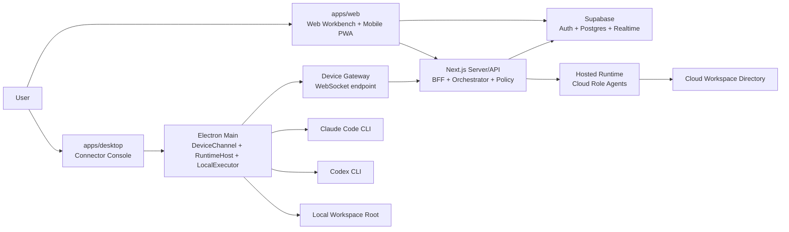

# AgentHub 技术设计文档

**作者：** joytion, Codex  
**日期：** 2026-05-22  
**状态：** Draft  
**版本：** 0.1  
**上游文档：** `research/prd.md`, `research/product-design.md`  
**模块研究依据：** `research/modules/*.md`, `research/reference-repos/*.md`

---

## 1. 技术设计目标

本文把 PRD 和产品设计收敛为可实现的 P0 技术方案。模块研究文档是选型依据层；本文是后续实现、任务拆分和评审的主技术依据。

P0 技术目标：

1. 跑通 Web、Desktop、Mobile 三端联动的 AgentHub 开发闭环。
2. 用统一数据模型约束 Cloud Workspace 和 Local Desktop Workspace，确保执行域不可混用。
3. 用统一 Runtime/Adapter 模型接入平台托管 Runtime、本地 Claude Code、本地 Codex。
4. 保证 Claude Code/Codex 接入是 native session continuity，而不是普通 API 文本调用。
5. 以 IM、消息、Artifact、Action、Approval、Runtime Event 的持久化数据作为真相源，Realtime 只作为投递层。

对应需求：`FR-AUTH-001`, `FR-WS-001`, `FR-DEVICE-001`, `FR-WEB-001`, `FR-DESK-001`, `FR-MOB-001`, `FR-CHAT-001`, `FR-RUNTIME-001`, `FR-ORCH-001`, `FR-CTX-001`, `FR-ARTIFACT-001`, `FR-RESULT-001`, `FR-ACTION-001`, `FR-PERM-001`, `FR-NOTIFY-001`, `NFR-SEC-001`, `NFR-OBS-001`。

---

## 2. 最终技术路线

| 模块 | P0 技术路线 | 绑定需求 |
| --- | --- | --- |
| Web 主工作台 | Next.js App Router + React + TypeScript | `FR-WEB-001`, `FR-CHAT-001`, `FR-ARTIFACT-001` |
| Desktop Connector | Electron + React + TypeScript；Electron main 负责本地能力 | `FR-DESK-001`, `FR-RUNTIME-001`, `FR-ACTION-001` |
| Mobile P0 | 同一 Next.js 应用的响应式 Web/PWA 路由 | `FR-MOB-001`, `FR-DEVICE-001` |
| Mobile Android 预留 | Capacitor 包装移动 Web/PWA；P0 不强制 Android Studio | `FR-MOB-001`, `FR-NOTIFY-101` |
| 共享层 | `packages/shared` 纯 TypeScript 类型、协议、状态机、API client | `FR-WS-001`, `FR-RUNTIME-001`, `FR-PERM-001` |
| Auth | Supabase Auth + GitHub OAuth | `FR-AUTH-001` |
| DB | Supabase Postgres | `FR-WS-001`, `FR-CHAT-001`, `FR-RESULT-001` |
| Realtime | Supabase Realtime 订阅消息、事件、审批状态 | `FR-CHAT-001`, `FR-NOTIFY-001` |
| Desktop 通道 | `DeviceChannel` 接口，P0 实现为 Desktop 主动 WebSocket 长连接 | `FR-DEVICE-001`, `FR-DESK-001`, `NFR-SEC-001` |
| Runtime Adapter | Hosted Runtime、Claude Code CLI Adapter、Codex CLI Adapter | `FR-RUNTIME-001`, `FR-AGENT-001`, `FR-CTX-001` |
| Action/CLI Adapter | 统一 `ActionRequest`，P0 支持 preview/test/build/shell，deploy 仅保留兼容字段 | `FR-ACTION-001`, `FR-PERM-001`, `FR-RESULT-001` |
| Orchestrator | 后端状态机托管，LLM 只生成澄清、计划、总结内容 | `FR-ORCH-001`, `FR-CTX-001`, `FR-PERM-001` |

不进入 P0 的技术承诺：

- React Native/Expo 独立移动端。
- Tauri Desktop 替换 Electron。
- OpenCode Adapter。
- 完整部署平台。
- 非 Git checkpoint、patch stack、回滚系统。
- 多真人协作权限模型。

对应需求：`FR-RUNTIME-201`, `FR-PUBLISH-201`, `FR-VERSION-201`, `FR-COLLAB-201`。

---

## 3. 仓库与应用结构

推荐 Monorepo 结构：

```text
apps/
  web/
    app/                    # Next.js Web + Mobile PWA routes
    components/             # React DOM UI components
    server/                 # BFF/API route handlers, server actions, Supabase clients
  desktop/
    src/main/               # Electron main: DeviceChannel, RuntimeHost, LocalExecutor
    src/preload/            # typed bridge, no broad Node exposure
    src/renderer/           # Connector Console React UI

packages/
  shared/
    src/domain/             # Workspace, Session, Message, Artifact, RoleAgent types
    src/protocol/           # DeviceChannel frames, RuntimeEvent, ActionRequest
    src/state-machines/     # message/action/orchestrator/permission states
    src/api-client/         # typed API client for web, desktop, mobile routes
    src/policies/           # execution-domain and permission policy functions

future/
  apps/mobile-native/       # React Native/Expo only if mobile workload becomes native-heavy
```

工程边界：

- Web UI 组件不承诺迁移到 React Native。
- `packages/shared` 不依赖 DOM、Electron、Node-only API 或 Supabase SDK 实例。
- Electron renderer 不直接访问文件系统、shell、环境变量或子进程；只能通过 preload 暴露的 typed IPC 调 main process。
- Desktop main 是 Local Desktop Workspace 的本地执行边界。

对应需求：`FR-DEVICE-001`, `FR-WEB-001`, `FR-DESK-001`, `FR-MOB-001`, `FR-RUNTIME-001`, `NFR-SEC-001`。

---

## 4. 总体架构



关键原则：

- Web 是完整工作台，Mobile PWA 是同一 Web 应用的轻量入口。
- Desktop 是 Connector，不复制三栏工作台。
- Cloud Workspace 的 Action 和 Runtime 只在云端项目目录执行。
- Local Desktop Workspace 的 Action 和 Runtime 只通过在线 Desktop Connector 执行。
- Web/Mobile 是控制端，可以对 Cloud Workspace 或 Local Desktop Workspace 发送消息、审批和 Action 指令；但本地文件读写、命令执行和 Runtime 调用只能由 Desktop Connector 落地。
- Web/Mobile 进程不承载本地文件执行能力，也不通过浏览器、手机或用户电脑端口绕过 Desktop Connector。

对应需求：`FR-DEVICE-001`, `FR-WS-001`, `FR-DESK-001`, `FR-MOB-001`, `FR-ACTION-001`, `NFR-SEC-001`。

---

## 5. 执行域模型

### 5.1 核心枚举

```typescript
type ExecutionDomain = 'cloud' | 'local_desktop';
type RuntimeKind = 'hosted' | 'claude_code' | 'codex' | 'opencode';
```

### 5.2 强约束

| 约束 | 技术实现 |
| --- | --- |
| Workspace 创建后执行域不可变 | `workspaces.execution_domain` 创建后禁止更新 |
| Session 继承 Workspace 执行域 | `sessions.execution_domain` 由 Workspace 派生或冗余快照，不允许用户单独选择 |
| Role Agent Runtime 必须匹配 Workspace | 创建/更新 `role_agent_runtime_bindings` 时执行 policy 校验 |
| Action 执行位置必须匹配 Workspace | `actions.execution_domain` 由 Workspace 赋值，Executor 只按该字段路由 |
| Runtime session 不能跨域复用 | `runtime_sessions` 唯一键包含 `execution_domain` |
| 本地路径只能在授权 root 内 | Desktop main 对所有 path 做 resolve + root containment check |

### 5.3 运行时路由

```typescript
function resolveExecutor(workspace: Workspace, request: RuntimeRequest | ActionRequest) {
  assert(request.executionDomain === workspace.executionDomain);

  if (workspace.executionDomain === 'cloud') {
    return 'cloud_executor';
  }

  return 'desktop_connector';
}
```

阻断规则：

- `cloud` Workspace 不能绑定 `claude_code` 或 `codex`。
- `local_desktop` Workspace 不能绑定 `hosted` Runtime。
- Local Desktop Workspace 在 Desktop Connector 离线时可以聊天和查看历史，但不能执行 Runtime 或 Action。

对应需求：`FR-WS-001`, `FR-RUNTIME-001`, `FR-ACTION-001`, `FR-DESK-001`, `NFR-SEC-001`。

---

## 6. 身份、设备与 Workspace

### 6.1 Auth

P0 使用 Supabase Auth + GitHub OAuth。Web、Desktop、Mobile 共享同一 AgentHub user identity。

身份对象：

- `auth.users`: Supabase 用户。
- `profiles`: AgentHub 用户资料，包含 GitHub identity 摘要。
- `devices`: Desktop Connector 设备记录。

Desktop 绑定建议：

1. 用户在 Web 登录后生成一次性 device binding code。
2. Desktop 输入绑定码或打开绑定链接。
3. 后端校验绑定码，把 Desktop 设备绑定到同一 user。
4. Desktop 获得 device token，用于 WebSocket DeviceChannel 鉴权。

对应需求：`FR-AUTH-001`, `FR-DESK-001`。

### 6.2 Workspace 创建

Cloud Workspace：

- Web 创建 Workspace。
- 后端创建云端项目目录记录。
- Role Agent 只能绑定 Hosted Runtime。

Local Desktop Workspace：

- Web 可发起创建，但本地文件夹选择必须由 Desktop 完成。
- Desktop 选择已有目录或按用户文件夹名创建目录。
- 后端保存 workspace root 的设备侧标识、展示名和 hash，不把 Web 变成任意本地路径写入入口。

对应需求：`FR-WS-001`, `FR-DEVICE-001`, `FR-DESK-001`。

---

## 7. 核心数据模型

以下是 P0 逻辑模型，落库时可按 Supabase/Postgres 命名转换。

### 7.1 Workspace 与设备

```typescript
interface Workspace {
  id: string;
  ownerUserId: string;
  name: string;
  executionDomain: ExecutionDomain;
  cloudProjectRef?: string;
  desktopDeviceId?: string;
  localRootRef?: string;
  defaultPermissionPolicyId: string;
  createdAt: string;
}

interface Device {
  id: string;
  userId: string;
  kind: 'desktop';
  name: string;
  status: 'offline' | 'online' | 'reconnecting';
  lastSeenAt?: string;
}
```

对应需求：`FR-AUTH-001`, `FR-WS-001`, `FR-DEVICE-001`, `FR-DESK-001`。

### 7.2 Session、消息与 Artifact

```typescript
type MessageKind =
  | 'user_text'
  | 'agent_text'
  | 'orchestrator_question'
  | 'system_status'
  | 'artifact_card'
  | 'action_card'
  | 'task_result_card';

type MessageStatus =
  | 'pending'
  | 'streaming'
  | 'completed'
  | 'failed'
  | 'requires_confirmation';

type ArtifactKind =
  | 'markdown'
  | 'code_block'
  | 'image'
  | 'file_ref'
  | 'web_preview'
  | 'diff'
  | 'action_status';

interface Session {
  id: string;
  workspaceId: string;
  executionDomain: ExecutionDomain;
  title: string;
  routeMode: 'direct_role' | 'orchestrated';
  autoProceedEnabled: boolean;
  status: 'active' | 'waiting_user' | 'running' | 'failed' | 'completed';
}

interface Message {
  id: string;
  workspaceId: string;
  sessionId: string;
  roleAgentId?: string;
  kind: MessageKind;
  status: MessageStatus;
  content: string;
  artifactIds: string[];
  createdAt: string;
}

interface Artifact {
  id: string;
  workspaceId: string;
  sessionId: string;
  kind: ArtifactKind;
  title: string;
  metadata: Record<string, unknown>;
  storageRef?: string;
  createdAt: string;
}
```

Markdown、代码块复制、图片、文件引用、网页预览、Diff 卡片、Action 状态卡都通过 `Message` + `Artifact` 表达。Diff 是 Artifact，不是审批对象。

对应需求：`FR-CHAT-001`, `FR-ARTIFACT-001`, `FR-RESULT-001`, `FR-NOTIFY-001`。

### 7.3 Role Agent 与 Runtime

```typescript
interface RoleAgent {
  id: string;
  workspaceId: string;
  name: string;
  roleType: 'orchestrator' | 'frontend' | 'tester' | 'reviewer' | 'pm' | 'custom';
  systemPrompt: string;
  capabilityTags: string[];
  allowOrchestratorDispatch: boolean;
}

interface RuntimeBinding {
  id: string;
  workspaceId: string;
  roleAgentId: string;
  runtimeKind: RuntimeKind;
  executionDomain: ExecutionDomain;
  configRef?: string;
}

interface RuntimeSession {
  id: string;
  workspaceId: string;
  sessionId: string;
  roleAgentId: string;
  runtimeKind: RuntimeKind;
  executionDomain: ExecutionDomain;
  cwd: string;
  nativeSessionId?: string;
  capabilitiesSnapshot: RuntimeCapabilities;
  status: 'starting' | 'running' | 'awaiting_approval' | 'completed' | 'failed' | 'cancelled';
  lastInvocationAt: string;
}
```

对应需求：`FR-AGENT-001`, `FR-RUNTIME-001`, `FR-CTX-001`。

### 7.4 Action、Approval 与 Result

```typescript
type ActionKind = 'preview' | 'test' | 'build' | 'shell' | 'deploy';
type ActionStatus = 'pending' | 'running' | 'succeeded' | 'failed' | 'canceled';
type RiskLevel = 'low' | 'medium' | 'high';

interface ActionRequest {
  id: string;
  workspaceId: string;
  sessionId: string;
  requestedByRoleAgentId?: string;
  requestedByOrchestrator: boolean;
  executionDomain: ExecutionDomain;
  kind: ActionKind;
  command?: string;
  args?: string[];
  workingDirectory: string;
  riskLevel: RiskLevel;
  status: ActionStatus;
}

interface PendingApproval {
  id: string;
  workspaceId: string;
  sessionId: string;
  sourceType: 'orchestrator_plan' | 'next_step' | 'permission_upgrade' | 'action' | 'retry';
  sourceId: string;
  riskLevel: RiskLevel;
  status: 'pending' | 'approved' | 'rejected' | 'expired';
  requestedAt: string;
  decidedAt?: string;
}

interface TaskResult {
  id: string;
  workspaceId: string;
  sessionId: string;
  roleAgentId?: string;
  status: 'succeeded' | 'failed' | 'partial';
  summary: string;
  changedFiles: Array<{ path: string; status: 'added' | 'modified' | 'deleted' | 'renamed' }>;
  diffArtifactId?: string;
  previewArtifactId?: string;
  actionIds: string[];
}
```

对应需求：`FR-ACTION-001`, `FR-PERM-001`, `FR-NOTIFY-001`, `FR-RESULT-001`。

---

## 8. Realtime 与持久化策略

P0 采用 Supabase Postgres 作为真相源，Supabase Realtime 作为订阅层。

订阅范围：

- Web/Mobile 订阅当前 Workspace/Session 的 messages、artifacts、actions、pending approvals、orchestrator runs。
- Desktop 订阅与自身 device/workspace 相关的 approvals 和 execution summaries；真正的本地执行请求通过 DeviceChannel 下发。

持久化规则：

- 消息、Artifact、Action、Approval、Runtime Event 必须落库。
- 流式 token 或 runtime event 可先写入 `runtime_events`，再聚合更新 `messages.content`。
- 前端断线重连后必须重新查询 Session snapshot，而不是假设 Realtime 没漏事件。
- DeviceChannel 帧带 `seq` 和 `requestId`，后端可检测 ack 和超时。

对应需求：`FR-CHAT-001`, `FR-NOTIFY-001`, `FR-RESULT-001`, `NFR-OBS-001`。

---

## 9. DeviceChannel 协议

`DeviceChannel` 是代码接口，P0 底层直接使用 WebSocket。它隔离鉴权、心跳、重连、ack、请求路由和事件回传。

### 9.1 连接生命周期

```typescript
type DeviceConnectionStatus =
  | 'connecting'
  | 'authenticating'
  | 'connected'
  | 'reconnecting'
  | 'disconnected';
```

连接流程：

1. Desktop 用 device token 主动连接云端 WebSocket endpoint。
2. 首帧发送 auth。
3. 后端返回 connected 和 device/workspace scope。
4. 双方 heartbeat。
5. 断线后 Desktop 指数退避重连。
6. 重连后 Desktop 拉取 missed requests 或后端重放未 ack 请求。

### 9.2 帧模型

```typescript
type DeviceFrame =
  | { kind: 'request'; seq: number; requestId: string; type: DeviceRequestType; payload: unknown }
  | { kind: 'response'; seq: number; requestId: string; ok: boolean; payload?: unknown; error?: DeviceError }
  | { kind: 'event'; seq: number; eventId: string; type: DeviceEventType; payload: unknown }
  | { kind: 'heartbeat'; seq: number; sentAt: string };

type DeviceRequestType =
  | 'runtime.invoke'
  | 'runtime.cancel'
  | 'action.execute'
  | 'action.cancel'
  | 'runtime.detect'
  | 'workspace.bind_local_root';

type DeviceEventType =
  | 'runtime.event'
  | 'action.event'
  | 'detector.status'
  | 'workspace.status';
```

安全边界：

- Web/Mobile 可以控制 Local Desktop Workspace，但不与 Desktop 做点对点直连；控制请求统一进入后端，再通过 Desktop 主动建立的 DeviceChannel 下发。
- Desktop 只接受后端签发、scope 匹配、workspace 匹配的请求。
- 本地执行请求必须已经通过权限策略或审批。

对应需求：`FR-DEVICE-001`, `FR-DESK-001`, `FR-ACTION-001`, `FR-PERM-001`, `NFR-SEC-001`。

---

## 10. Runtime Adapter 设计

### 10.1 Adapter 分层

| 层 | 职责 |
| --- | --- |
| Runtime Detector | 检测 CLI/服务是否存在、版本、认证状态、能力声明 |
| Process/Transport Layer | launch、stdin、stdout、stderr、cancel、restart、timeout、HTTP/SSE |
| Runtime Parser | 把 Claude/Codex 原始输出映射成 `RuntimeEvent` |
| Runtime Session Store | 记录 AgentHub session 与 native session identity 的绑定 |
| Runtime Host | 按 Workspace 执行域把请求路由到 Hosted Runtime 或 Desktop main |

对应需求：`FR-RUNTIME-001`, `FR-DESK-001`, `FR-CTX-001`, `FR-PERM-001`。

### 10.2 Adapter 接口

```typescript
interface RuntimeCapabilities {
  supportsResume: boolean;
  supportsContinue: boolean;
  supportsApprovals: boolean;
  supportsNativeSessionDiscovery: boolean;
  supportsHttpSse: boolean;
  supportsMcpConfig: boolean;
  supportsPermissionModes: boolean;
  supportsStreamingEvents: boolean;
}

interface RuntimeAdapter {
  kind: RuntimeKind;
  adapterVersion: string;
  detect(input: RuntimeDetectInput): Promise<RuntimeDetectionResult>;
  getCapabilities(input: RuntimeDetectInput): Promise<RuntimeCapabilities>;
  createSession(input: RuntimeInvokeInput): Promise<RuntimeInvocation>;
  resumeSession(input: RuntimeResumeInput): Promise<RuntimeInvocation>;
  continueLatest(input: RuntimeContinueInput): Promise<RuntimeInvocation>;
  stream(invocationId: string): AsyncIterable<RuntimeEvent>;
  sendInput(invocationId: string, input: RuntimeStdinInput): Promise<void>;
  cancel(invocationId: string): Promise<void>;
  restart(invocationId: string): Promise<RuntimeInvocation>;
  discoverNativeSessions(input: NativeSessionDiscoveryInput): Promise<NativeSessionRef[]>;
}
```

### 10.3 RuntimeEvent

```typescript
type RuntimeEvent =
  | { type: 'started'; invocationId: string; nativeSessionId?: string }
  | { type: 'session_discovered'; nativeSessionId: string; source: 'stdout' | 'jsonl' | 'filesystem' }
  | { type: 'text_delta'; content: string; channel?: 'assistant' | 'thinking' | 'system' }
  | { type: 'tool_started'; toolCallId: string; name: string; inputPreview?: string }
  | { type: 'tool_delta'; toolCallId: string; content: string }
  | { type: 'tool_completed'; toolCallId: string; outputPreview?: string; exitCode?: number }
  | { type: 'approval_requested'; approvalId: string; reason: string; commandPreview?: string }
  | { type: 'permission_mode_changed'; mode: string; reason?: string }
  | { type: 'artifact_created'; artifactId: string; path?: string; mimeType?: string }
  | { type: 'completed'; summary?: string; nativeSessionId?: string }
  | { type: 'failed'; errorCode: RuntimeErrorCode; message: string; retryable: boolean }
  | { type: 'cancelled'; reason?: string };
```

### 10.4 Claude Code 与 Codex 策略

Claude Code：

- P0 通过 Desktop main 启动 CLI 子进程。
- 使用 CLI 支持的 resume/continue 能力恢复原生会话，具体参数由实现阶段基于本机版本验证。
- 可以读取原生会话目录做 discovery，但 discovery 只是校准和回填，不直接编辑原生 JSONL。

Codex：

- P0 通过 Desktop main 启动 `codex exec --json` 或等价 JSONL 入口。
- 使用 Codex resume 能力恢复 native session。
- Codex approval、tool call、exit/error 归一化到 `RuntimeEvent`。

关键规则：

- Runtime Adapter 接收结构化 `ContextPackage` 和 `RuntimeInvokeInput`，不接收裸 prompt。
- `nativeSessionId` 必须进入 `runtime_sessions`。
- 同一 AgentHub Session 内同一 Role Agent 后续消息优先 resume 对应 native session。
- Parser 失败时保留 raw event 摘要并生成 diagnostic failure，不能静默丢事件。
- `dangerous_bypass` 或类似危险权限模式不得默认启用。

对应需求：`FR-RUNTIME-001`, `FR-AGENT-001`, `FR-CTX-001`, `FR-RESULT-001`, `FR-PERM-001`。

---

## 11. Orchestrator 状态机

Orchestrator 是 PM 型 Role Agent，但状态推进由后端状态机控制。

```typescript
type OrchestratorRunStatus =
  | 'idle'
  | 'clarifying'
  | 'planning'
  | 'requires_plan_confirmation'
  | 'dispatching'
  | 'waiting_role_result'
  | 'summarizing'
  | 'requires_next_step_confirmation'
  | 'completed'
  | 'failed'
  | 'canceled';
```

### 11.1 路由规则

| 输入 | 路由 |
| --- | --- |
| 未 @ Role Agent | Orchestrated Flow |
| @ Orchestrator | Orchestrated Flow |
| @ 单个非 Orchestrator Role Agent | Direct Role Flow |
| @ 多个 Role Agent | Orchestrated Flow |
| Direct Role 判断需多角色 | 请求用户升级到 Orchestrated Flow |

### 11.2 Orchestrated Flow

1. 后端创建 `orchestrator_run`。
2. 需求不足时进入 `clarifying` 并生成澄清问题。
3. 信息足够时进入 `planning` 并生成计划卡。
4. 默认进入 `requires_plan_confirmation`。
5. 用户确认后进入 `dispatching`。
6. 后端构造 `ContextPackage`，按计划分派给 Role Agent。
7. Runtime/Action 事件持续写入 `runtime_events`、`messages`、`actions`。
8. Orchestrator 汇总结果，进入 `completed` 或 `requires_next_step_confirmation`。

### 11.3 自动推进

- 用户必须显式开启 Session `autoProceedEnabled`。
- 自动推进只跳过低风险计划确认和普通下一步确认。
- 高风险 Action、权限升级、部署/发布、删除/覆盖/批量修改必须确认。

对应需求：`FR-CHAT-001`, `FR-ORCH-001`, `FR-CTX-001`, `FR-PERM-001`, `FR-NOTIFY-001`。

---

## 12. Context Package 与 Handoff

```typescript
interface ContextPackage {
  workspaceId: string;
  sessionId: string;
  sourceMessageIds: string[];
  pinnedMessageIds: string[];
  artifactIds: string[];
  fileRefs: Array<{ path: string; reason: string }>;
  priorRoleSummaries: Array<{ roleAgentId: string; summary: string }>;
  currentGoal: string;
  constraints: string[];
}
```

Handoff 规则：

- 目标永远是 Role Agent，不是 Claude Code、Codex 等 Runtime 名称。
- Context Package 可以被用户查看、引用、pin。
- Handoff 到绑定 Claude Code/Codex 的 Role Agent 时，Adapter 尝试恢复该 Role Agent 在当前 Session 的 native session。
- 文件引用必须受 Workspace execution domain 和本地 root/cloud root 约束。

对应需求：`FR-CTX-001`, `FR-RUNTIME-001`, `FR-AGENT-001`, `FR-ARTIFACT-001`。

---

## 13. Action/CLI 与权限模型

### 13.1 Action Executor

| Workspace 类型 | Executor | 路径约束 |
| --- | --- | --- |
| Cloud Workspace | Cloud Executor | `workingDirectory` 在云端项目目录内 |
| Local Desktop Workspace | Desktop Executor | `workingDirectory` 在授权 local root 内 |

P0 Action：

- `preview`: 启动 dev server 或返回 preview URL。
- `test`: 运行测试命令。
- `build`: 运行构建命令。
- `shell`: 受控 shell 命令。
- `deploy`: 仅保留兼容状态，不做真实部署平台。

### 13.2 权限矩阵

| 对象 | 默认风险 | P0 确认策略 |
| --- | --- | --- |
| Orchestrator 计划 | medium | 默认确认，可被 Session 自动推进跳过 |
| 低风险读取或状态查询 | low | 可按策略自动 |
| 启动预览 | medium | 默认确认 |
| 测试/构建 | medium | 可按 Session 策略确认或自动 |
| Shell 命令 | high | 必须确认 |
| 删除/覆盖/批量修改 | high | 必须确认 |
| 部署/发布 | high | 必须确认 |
| 失败重试 | medium | 默认确认 |

Diff 展示不是审批对象；需要确认的是 Action、计划、下一步、权限升级或失败重试。

对应需求：`FR-ACTION-001`, `FR-PERM-001`, `FR-NOTIFY-001`, `FR-RESULT-001`。

---

## 14. API 契约草案

P0 可以先由 Next.js Route Handlers 或 Server Actions 实现，后续再拆独立 API 服务。

| API | 方法 | 用途 | 绑定需求 |
| --- | --- | --- | --- |
| `/api/workspaces` | `GET/POST` | 列表、创建 Workspace | `FR-WS-001` |
| `/api/workspaces/:id` | `GET` | Workspace 详情和执行域状态 | `FR-WS-001`, `FR-DEVICE-001` |
| `/api/sessions` | `GET/POST` | Session 列表和创建 | `FR-CHAT-001` |
| `/api/sessions/:id/messages` | `GET/POST` | 消息读取和发送 | `FR-CHAT-001` |
| `/api/role-agents` | `GET/POST/PATCH` | Role Agent 模板、创建、编辑 | `FR-AGENT-001` |
| `/api/runtime-bindings` | `POST/PATCH` | 绑定 Runtime，执行域校验 | `FR-RUNTIME-001` |
| `/api/orchestrator-runs` | `POST` | 创建 Orchestrator run | `FR-ORCH-001` |
| `/api/actions` | `POST` | 创建 ActionRequest | `FR-ACTION-001` |
| `/api/approvals/:id/decision` | `POST` | 批准或拒绝确认项 | `FR-PERM-001`, `FR-NOTIFY-001` |
| `/api/devices/bind-code` | `POST` | 生成 Desktop 绑定码 | `FR-AUTH-001`, `FR-DESK-001` |
| `/api/devices/ws` | `WebSocket` | Desktop DeviceChannel | `FR-DESK-001`, `FR-DEVICE-001` |

API 层必须调用 shared policy：

- `assertWorkspaceAccess(userId, workspaceId)`
- `assertExecutionDomainMatch(workspace, request)`
- `assertRuntimeBindingAllowed(workspace, runtimeKind)`
- `assertActionAllowedOrCreateApproval(action, policy)`
- `assertPathInsideWorkspaceRoot(path, root)`，本地版本只在 Desktop main 执行

对应需求：`FR-AUTH-001`, `FR-WS-001`, `FR-RUNTIME-001`, `FR-ACTION-001`, `FR-PERM-001`。

---

## 15. 前端实现边界

### 15.1 Web

P0 页面：

- 登录页。
- Workspace 列表与创建向导。
- 三栏 IM 工作台。
- Role Agent 面板。
- Pending Approvals 队列。
- Workspace 设置页。

核心组件：

- `MessageRenderer`
- `MarkdownBlock`
- `CodeBlockWithCopy`
- `ArtifactCard`
- `DiffCard`
- `ActionStatusCard`
- `TaskResultCard`
- `OrchestratorPlanCard`
- `PermissionConfirmationCard`
- `RoleMentionPicker`

对应需求：`FR-WEB-001`, `FR-CHAT-001`, `FR-ARTIFACT-001`, `FR-RESULT-001`, `FR-ORCH-001`。

### 15.2 Desktop

P0 页面：

- 登录/设备绑定。
- Connector 首页。
- 本地 Workspace 绑定。
- Runtime 检测。
- 执行请求列表。
- 待审批队列。
- 打开 Web。

Desktop main 服务：

- `DeviceChannelService`
- `WorkspaceFolderService`
- `RuntimeDetectorService`
- `RuntimeHostService`
- `LocalExecutorService`
- `AuditEventService`

对应需求：`FR-DESK-001`, `FR-RUNTIME-001`, `FR-ACTION-001`, `FR-NOTIFY-001`。

### 15.3 Mobile PWA

P0 页面：

- 登录页。
- Workspace 列表。
- Session 列表。
- 轻量 Session 页。
- 审批详情页。
- 预览页。

降级规则：

- 不提供本地 Runtime 接入。
- 不选择本地文件夹。
- Diff 只读展开。
- 大输出默认折叠。

对应需求：`FR-MOB-001`, `FR-NOTIFY-001`, `FR-ARTIFACT-001`, `FR-RESULT-001`。

---

## 16. 错误码与可观察性

标准错误族：

| 错误码 | 场景 |
| --- | --- |
| `AUTH_REQUIRED` | 用户、设备或 Runtime 未登录 |
| `DEVICE_OFFLINE` | Local Desktop Workspace 的 Desktop Connector 不在线 |
| `EXECUTION_DOMAIN_MISMATCH` | Runtime/Action 与 Workspace 执行域不一致 |
| `RUNTIME_NOT_FOUND` | Claude Code/Codex CLI 未检测到 |
| `RUNTIME_AUTH_REQUIRED` | Runtime 本身未登录或不可调用 |
| `NATIVE_SESSION_NOT_FOUND` | resume 的 native session 不存在 |
| `CWD_MISMATCH` | native session 或请求 cwd 与 Workspace root 不匹配 |
| `APPROVAL_REQUIRED` | 策略要求用户确认 |
| `APPROVAL_REJECTED` | 用户拒绝执行 |
| `PATH_OUTSIDE_WORKSPACE` | 本地或云端路径越界 |
| `ACTION_FAILED` | Action 执行失败 |
| `PARSER_UNSUPPORTED_EVENT` | Runtime 原始事件无法解析 |

可观察性原则：

- 用户可见：失败原因、是否可重试、需要去哪里修复。
- 系统可查：runtime raw event 摘要、action stdout/stderr 摘要、device seq/ack 状态。
- 不提交或展示：密钥、完整敏感环境变量、用户未授权路径内容。

对应需求：`FR-DESK-001`, `FR-RUNTIME-001`, `FR-ACTION-001`, `NFR-OBS-001`, `NFR-SEC-002`。

---

## 17. P0 实现顺序

### 17.1 基础骨架

1. 建立 monorepo：`apps/web`, `apps/desktop`, `packages/shared`。
2. 建立 shared domain types、FR-ID 常量、execution domain policy。
3. 接入 Supabase Auth + GitHub OAuth。

绑定需求：`FR-AUTH-001`, `FR-WS-001`, `FR-DEVICE-001`。

### 17.2 Workspace 与 IM

1. Workspace 创建、列表、执行域展示。
2. Session 创建、消息发送、消息列表。
3. Markdown 渲染、代码高亮、复制、基础 Artifact 卡片。

绑定需求：`FR-WS-001`, `FR-WEB-001`, `FR-CHAT-001`, `FR-ARTIFACT-001`。

### 17.3 Desktop Connector

1. Desktop 设备绑定。
2. WebSocket DeviceChannel。
3. 本地 Workspace 文件夹绑定。
4. Claude Code/Codex 检测。

绑定需求：`FR-DESK-001`, `FR-RUNTIME-001`, `FR-DEVICE-001`。

### 17.4 Runtime Adapter

1. Hosted Runtime 最小实现，用于 Cloud Workspace 角色。
2. Claude Code CLI Adapter。
3. Codex CLI Adapter。
4. `runtime_sessions` native session identity 记录和 resume。

绑定需求：`FR-RUNTIME-001`, `FR-AGENT-001`, `FR-CTX-001`。

### 17.5 Orchestrator、Action 与审批

1. Orchestrator 状态机和计划卡。
2. Pending Approval 队列。
3. ActionRequest preview/test/build/shell。
4. Task Result Card、Diff Artifact、Preview URL。

绑定需求：`FR-ORCH-001`, `FR-ACTION-001`, `FR-PERM-001`, `FR-NOTIFY-001`, `FR-RESULT-001`。

### 17.6 Mobile PWA

1. 移动 Workspace/Session 列表。
2. 轻量消息、@ Role Agent。
3. 审批详情。
4. 预览页和结果摘要。

绑定需求：`FR-MOB-001`, `FR-CHAT-001`, `FR-NOTIFY-001`, `FR-RESULT-001`。

---

## 18. 测试策略

P0 必须优先覆盖会导致安全边界或核心闭环失败的测试。

| 测试范围 | 必测点 | 绑定需求 |
| --- | --- | --- |
| Policy unit tests | execution domain mismatch、runtime binding allowed、action risk policy | `FR-WS-001`, `FR-RUNTIME-001`, `FR-PERM-001` |
| Shared state tests | message/action/orchestrator 状态转移 | `FR-CHAT-001`, `FR-ACTION-001`, `FR-ORCH-001` |
| API integration tests | Workspace、Session、Message、Approval CRUD 与鉴权 | `FR-AUTH-001`, `FR-CHAT-001`, `FR-NOTIFY-001` |
| Desktop unit tests | path containment、request scope、runtime detection parse | `FR-DESK-001`, `NFR-SEC-001` |
| Runtime adapter tests | Claude/Codex parser fixture、resume fallback、error mapping | `FR-RUNTIME-001`, `FR-CTX-001` |
| E2E smoke | GitHub OAuth mock、创建 Workspace、发送消息、审批 Action、展示结果卡 | P0 主路径 |

测试原则：

- Adapter parser 使用 fixture，不依赖每次测试真实调用 CLI。
- 真 CLI 验证作为手工或 gated integration test。
- 本地路径越界和 execution domain mismatch 必须是自动化测试。

对应需求：`NFR-SEC-001`, `NFR-OBS-001`, `FR-RUNTIME-001`, `FR-ACTION-001`。

---

## 19. 风险与缓解

| 风险 | 影响 | 缓解 |
| --- | --- | --- |
| Claude/Codex CLI 输出 schema 变化 | Parser 失效、事件丢失 | Adapter 带版本、保留 raw event 摘要、fixture 测试、降级 diagnostic event |
| native session discovery 不稳定 | 用户误以为上下文已连续 | resume 以 CLI 能力为主，discovery 只做辅助回填；失败展示明确原因 |
| Desktop 离线导致 Local Workspace 不可执行 | Web/Mobile 远程控制失败 | UI 明确展示 Connector 状态，Action 阻塞为 `DEVICE_OFFLINE` |
| Supabase Realtime 事件丢失或延迟 | 消息状态不同步 | DB 为真相源，重连后拉 snapshot |
| WebSocket DeviceChannel ack 丢失 | 重复执行或请求悬挂 | requestId 幂等、seq、ack、超时和重放策略 |
| 权限策略绕过 | 本地文件或命令风险 | shared policy + API 校验 + Desktop main 二次校验 |
| Electron renderer 权限过大 | 本地安全边界弱 | preload typed IPC，renderer 不直接启用 Node |
| Mobile PWA 被误认为完整 App | 交付预期偏差 | P0 明确为 PWA；Android App 使用 Capacitor 作为 P1/P2 包装路线 |

对应需求：`NFR-SEC-001`, `NFR-SEC-002`, `NFR-UX-002`, `FR-DEVICE-001`, `FR-RUNTIME-001`。

---

## 20. 与模块研究的追溯关系

| 本文结论 | 研究依据 |
| --- | --- |
| Next.js + Electron + PWA + Capacitor 预留 | `research/modules/client-shells.md` |
| Supabase Auth/Postgres/Realtime | `research/modules/auth-workspace.md`, `research/modules/im-foundation.md` |
| DeviceChannel = 接口，P0 WebSocket | `research/modules/desktop-connector.md`, `research/modules/reference-projects.md` |
| Claude Code/Codex 走 CLI 子进程 Adapter | `research/modules/runtime-adapters.md` |
| ActionRequest 统一 preview/test/build/shell/deploy 兼容 | `research/modules/action-cli-adapter.md` |
| Orchestrator 后端状态机 | `research/modules/orchestrator.md` |
| `packages/shared` 承载协议、类型和状态机 | `research/modules/client-shells.md`, `research/modules/reference-projects.md` |

用户主要审核本文和 `research/product-design.md`。模块研究文档用于追溯选型依据，发现本文问题时再反向修正对应模块研究或 PRD。

---

## 21. Phase 3 输入

进入实现阶段前，任务拆分应使用以下主输入：

1. `research/prd.md`：需求源和 FR-ID Registry。
2. `research/product-design.md`：页面、用户流、组件状态。
3. `research/technical-design.md`：技术路线、架构、数据模型、协议、实现顺序。
4. `research/modules/*.md`：模块研究依据，供实现遇到细节争议时查证。
5. `how_to_prd/ai-dev-tasks/generate-tasks.md`：任务拆分标准。

所有 `.trellis/tasks/*/` 实现切片必须引用对应 `FR-ID`，并优先把测试或验收检查写入任务定义。

对应需求：全部 P0 `FR-ID`。
